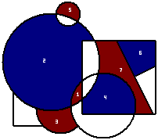
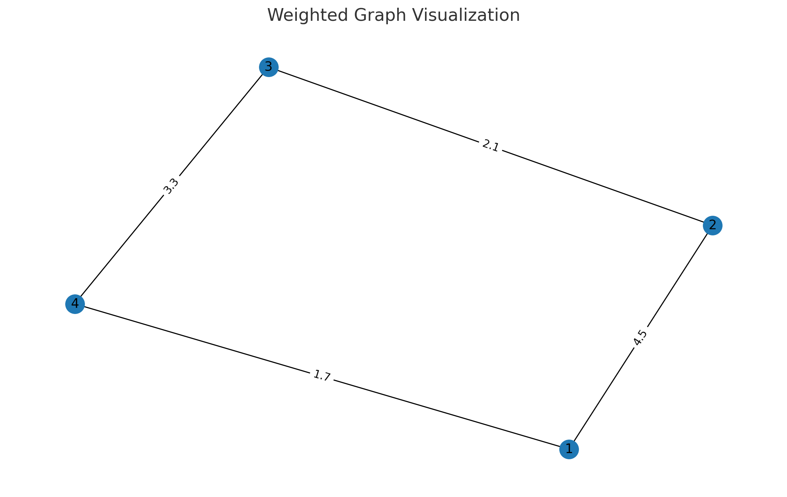
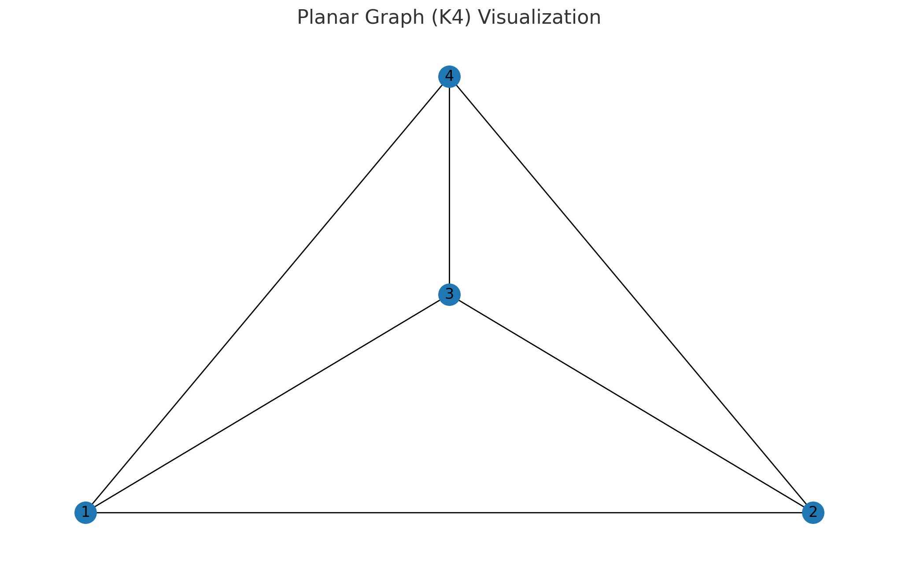

#  Relações entre conceitos e aplicações no projeto

## Introdução
O jogo Col é formalizado como um problema de coloração de faces em um grafo planar, onde cada face representa uma região a ser pintada alternadamente pelos dois jogadores (azul e vermelho). O desafio central é garantir que nenhuma face adjacente receba a mesma cor, um cenário clássico tratado pelo Teorema das Quatro Cores. Este documento descreve os fundamentos lógicos, algébricos e gráficos subjacentes, ilustrando cálculos e relacionamentos por meio de figuras.

> **Fig. 1**: Demonstração do jogo Col  
> 

## 1. Lógica Proposicional
Cada jogada é modelada pela proposição $P_{i,c}$: “a face i está colorida com a cor c”. 
A configuração do jogo em um instante t é um conjunto $P_t = {P_{i,c} | i ∈ V, c ∈ {azul,vermelho}}$. A restrição de validade é formalizada como:

$$
\forall (i,j) \in E, \neg(P_{i,c} \land P_{j,c})
$$

ou seja, para toda aresta $(i,j)$ no grafo $G=(V,E)$, não é permitido que as duas extremidades compartilhem a mesma cor $c$.

```python title="main/src/game.py"
# Verificação de restrição lógica proposicional em game.py
for j, other in enumerate(graph.faces):
    if j == idx or other['color'] is None:
        continue
    # arestas das faces f e other
    edges_o = set(tuple(sorted((ov[i], ov[(i+1)%len(ov)]))) for i in range(len(ov)))
    if edges_f & edges_o and other['color'] == cor:
        bloqueado = True
        break
```

## 2. Inferências e Provas
A detecção de jogadas possíveis usa regras de inferência (modus ponens) para verificar proposições ainda não atribuídas. 
Se não houver $P_{i,azul}$ nem $P_{i,vermelho}$ para alguma face $i$, então $i ∈ M_t$ (movimentos disponíveis). 
A vitória ocorre quando $M_t = ∅$, formalizado como prova de inconsistência:

1. Hipótese: $∃ i ∈ V$ tal que nem $P_{i,azul}$ nem $P_{i,vermelho}$ é verdadeira.
2. Contradição com a definição de $M_t=∅$.
3. Conclusão: jogador anterior é vencedor.

```python title="main/src/game.py"
# Detecção de movimentos disponíveis M_t em game.py
possible = False
for idx, face in enumerate(graph.faces):
    if face['color'] is not None:
        continue
    # monta arestas de face e verifica bloqueio
    bloqueado = False
    # ...cálculo edges_f similar ao clique anterior...
    if not bloqueado:
        possible = True
        break
if not possible:
    play.finished = True
    play.winner = 1 - play.turn
```

## 3. Lógica Algébrica de Conjuntos (LAC)
Define-se o conjunto das faces já coloridas por cada jogador:

- $A = {i | P_{i,azul} \text{ é verdadeira}}$
- $R = {i | P_{i,vermelho} \text{ é verdadeira}}$

As operações de união e interseção caracterizam regiões adjacentes:

$$
A \cup R = V, \quad A \cap R = ∅
$$

e a fronteira entre $A$ e $R$ é dada por $E(A,R) = \{(i,j) ∈ E | i ∈ A, j ∈ R\}$.

```python title="main/src/game.py"
# Conjuntos A e R (faces azul/vermelhas) em game.py
A = {i for i, f in enumerate(graph.faces) if f['color'] == PLAYER_COLORS[0]}
R = {i for i, f in enumerate(graph.faces) if f['color'] == PLAYER_COLORS[1]}
# Verifica A ∪ R = V e A ∩ R = ∅ em tempo de execução
assert set(range(len(graph.faces))) == A | R
assert A & R == set()
```

## 4. Teoria das Relações
A relação de adjacência $R_A ⊆ V × V$ é binária, simétrica e anti-reflexiva:

- $(i,j) ∈ R_A ⇔$ existe aresta entre faces $i$ e $j$.
- Para todo $i, (i,i) ∉ R_A$.
- Se $(i,j) ∈ R_A$ então $(j,i) ∈ R_A$.

A matriz de adjacência $M$ é definida por $M_{ij}=1$ se $(i,j)∈R_A, 0$ caso contrário.

> **Fig. 2**: Matriz de Adjacência
> 

```python title="main/src/planar_graph_convertion.py"
# Construção de R_A e matriz de adjacência em planar_graph_convertion.py
vid = {v: i for i, v in enumerate(vertices)}
adj = {i: [] for i in range(len(vertices))}
for a, b in edges:
    ia, ib = vid[a], vid[b]
    adj[ia].append(ib)
    adj[ib].append(ia)
# matriz M onde M[i][j] = 1 se adjacente
n = len(vertices)
M = [[1 if j in adj[i] else 0 for j in range(n)] for i in range(n)]
```

## 5. Teoria dos Grafos: Modelagem e Coloração
O grafo planar $G=(V,E)$ é extraído geométricamente a partir das formas geradas. A planaridade garante existência de embedding sem cruzamento de arestas.

O Teorema das Quatro Cores assegura $χ(G)≤4$, mas o algoritmo usado adota abordagem gulosa (greedy), com complexidade $O(|V|+|E|)$, atribuindo a cada vértice a menor cor disponível.

> **Fig. 3**: Exemplo de Grafo Planar
> 

```python title="main/src/graph.py"
# Extração de faces e algoritmo greedy em graph.py
faces = graph.detect_faces(vertices, edges)
# Exemplo de iteração gulosa (pseudo-código):
colors = {}
for i in range(len(faces)):
    usados = {colors[j] for j in adj[i] if j in colors}
    cores_disponiveis = set(range(4)) - usados
    colors[i] = min(cores_disponiveis)
```


## Aplicações no Código

- **planar_graph_convertion.py**: converte formas (polígonos, círculos, retângulos) em listas V (faces) e E (arestas) por detecção de interseção geométrica.
- **graph.py**: implementa classes `Graph` e `Coloring`, manipula matriz de adjacência e executa o algoritmo guloso para coloração incremental.
- **game.py**: função `play()` alterna jogadores, verifica M_t via inferência lógica e dispara condição de vitória com mensagem “Jogador {jogador} venceu”.
- **menu.py** e **main.py**: gerenciamento de fluxo, carregamento de figuras e interfaces gráficas.
- **shapes.py**: gera formas aleatórias, base para variação das instâncias de G.
- **constants.py**: define cores, layers e parâmetros visuais, garantindo consistência estético-lógica.

Cada módulo interage para traduzir conceitos teóricos em etapas computacionais, evidenciando a correspondência direta entre lógica formal, álgebra de conjuntos e teoria dos grafos aplicadas ao problema do jogo Col.
