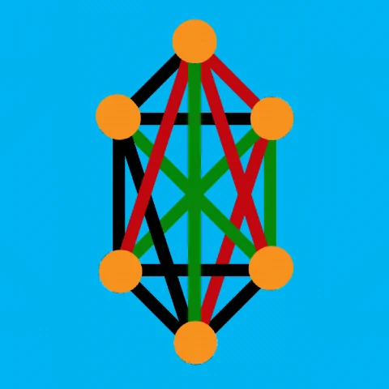
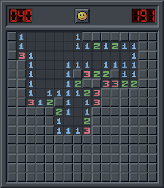
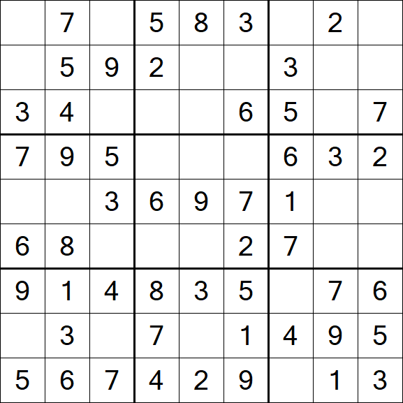
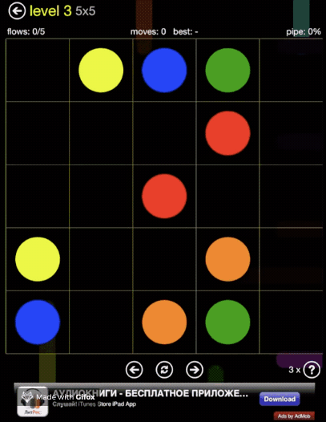
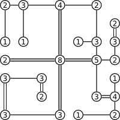
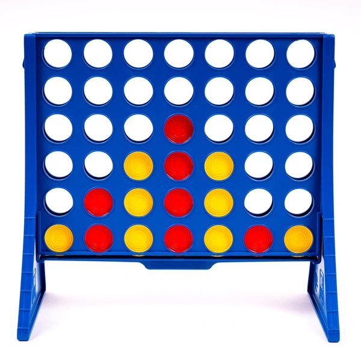
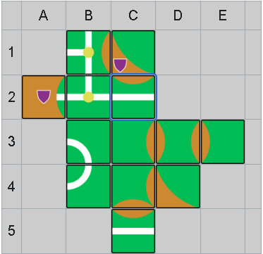
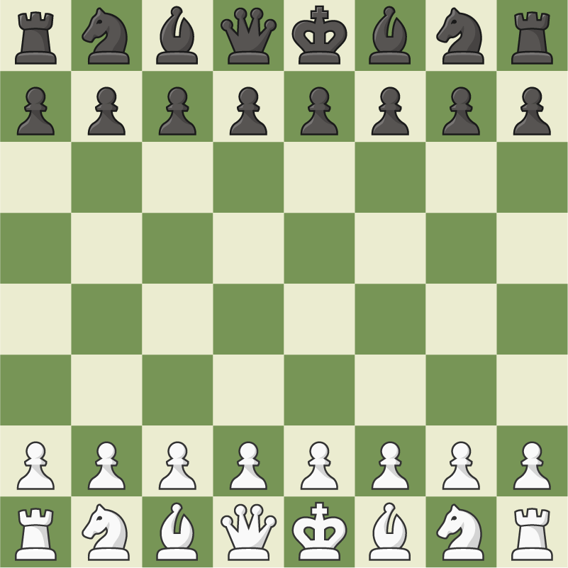

# Jogos

Os jogos a serem estudados neste trabalho serão escolhidos com base nos critérios a seguir:

- Baixa complexidade: o jogo deve ser simples de implementar e entender
- Jogabilidade alta: profundidade nas decisões, intuitividade para realizar ações e equilíbrio no jogo
- Aplicabilidade conceitual: capacidade de aplicação dos conceitos do estudo na implementação do jogo
- Impacto social: acessibilidade e capacidade de influência do jogo na sociedade

---

### Alternativas de desenvolvimento

- Pygame (Biblioteca - Linguagem Python)
- Cocos2d-x (Game Engine - Linguagens C++, JavaScript, TypeScript & Lua)
- libGDX (Framework - Linguagem Java)
- Godot (Framework - Linguagem GDScript)

### Possibilidades de jogos
| Jogo              | Possíveis conceitos de Grafos                                                         | Fase                                                         | Referências                                                  | Visualização                                                                 |
|-------------------|---------------------------------------------------------------------------------------|--------------------------------------------------------------|--------------------------------------------------------------|------------------------------------------------------------------------------|
| **Col**           | Coloração de vértices; Teorema de Ramsey para vizinhança adjacente                    | Implementar                                                  |                                                              |                                                                              |
| **Sim**           | Coloração de arestas em $K_6$, Ramsey $R(3,3)=6$                                      | Implementar                                                  | [Hexi Game](https://share.catrob.at/pocketcode/program/1478) |                 |
| **Campo Minado**  | Grafo de adjacência em grid; busca de componentes seguras (flood-fill)                | Analisar implementação pronta / Jogar / Analisar visualmente |                                                              |    |
| **Sudoku**        | Grafo de coloração (vértices = células; arestas = restrições de linha/bloco)          | Analisar implementação pronta / Jogar / Analisar visualmente |                                                              |                |
| **Flow Tree**     | Árvores geradoras em grade; caminhos sem ciclos                                       | Analisar implementação pronta                                |                                                              |               |
| **Hashiwokakero** | Conectividade e árvore geradora mínima; backtracking em tabuleiro de “ilhas e pontes” | Analisar implementação pronta                                |                                                              |  |
| **4 em linha**    | Game tree em grade; detecção de vitória via buscas em grafos                          | Analisar implementação pronta                                |                                                              |        |
| **Carcassonne**   | Grafos planos: conectividade de estradas e cidades ao posicionar peças                | Analisar implementação pronta                                |                                                              |       |
| **Xadrez**        | Game tree de posições; algoritmos minimax/α–β em grafo de transição de peças          | Jogar / Analisar visualmente                                 |                                                              |                |

Os jogos também podem ter alguns exemplos de aspectos indiretos nos seus protótipos, com relação ao [TCC - Universo Programado](https://www.universoprogramado.com/tcc.pdf):

- Máquinas de estados (state machines)  
    Menus, fluxos de jogo e lógica de fases (Flappy Bird, Dino do Chrome e simuladores) são quase sempre implementados como grafos dirigidos de estados e transições.
- Cenas e renderização
    Engines de jogos (pygame, Godot, libGDX) usam internamente scene graphs — árvores onde cada nó é um objeto na cena, definindo hierarquia e transformações.
- Particionamento espacial  
    Para colisões e queries de proximidade, usam-se árvores (quadtrees, k-d trees) ou grafos de vizinhança em grid, acelerando detecção de colisão.
- IA de NPCs / Oponentes  
    Pathfinding em pistas (simulador de corrida) ou navios (Pandemic, Ticket to Ride) recorre a grafos de waypoints e algoritmos de busca como A*.
- Pipeline de simulação  
    No simulador de foguete, o encadeamento de módulos (tanque → bomba → motor) pode ser modelado como grafo de dependências.

#### Col

O Col é um jogo onde dois jogadores alternam turnos para colorir vértices de um grafo planar, seguindo regras de coloração.  
O objetivo é evitar que dois vértices adjacentes tenham a mesma cor, refletindo o Teorema das Quatro Cores.

#### SIM

O SIM é um jogo de coloração de arestas, onde os jogadores devem colorir as arestas de um grafo completo $K_6$ de forma que não haja arestas adjacentes com a mesma cor.
O jogo é baseado no Teorema de Ramsey, que garante que em qualquer coloração de arestas de $K_6$, sempre haverá um triângulo monocromático (todas arestas de uma mesma cor).

A documentação de metodologia de ambos os jogos será feita em [tecnologias.md](tecnologias.md).