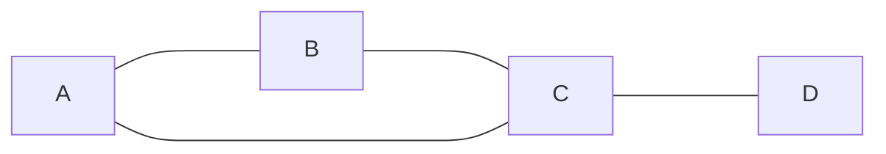
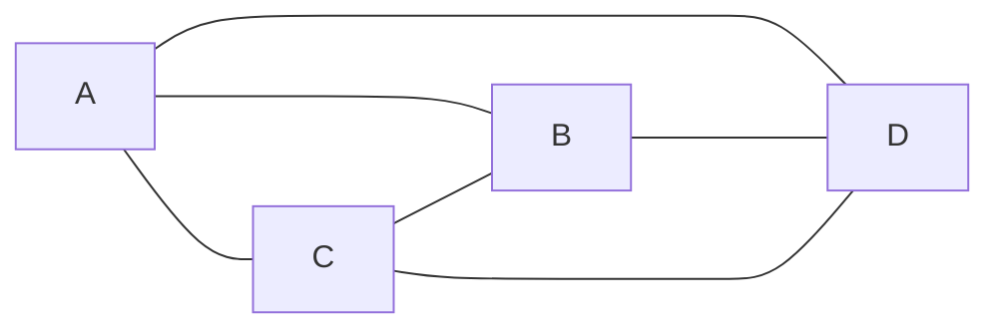

# Teoria dos Grafos

Este guia organiza e apresenta os principais conceitos de **Teoria dos Grafos**, com definições formais, exemplos (Mermaid e LaTeX) e ilustrações.

---

### 1. Formalização Básica

- **Grafo**  
  Um grafo é um par $G=(V,E)$ onde  
  - $V$ é um **conjunto finito de vértices**.  
  - $E\subseteq \{\{u,v\}\mid u,v\in V,\,u\neq v\}$ é o **conjunto de arestas** (para grafos simples não orientados).

- **Ordem**  
  $\lvert V\rvert$: número de vértices.

- **Tamanho**  
  $\lvert E\rvert$: número de arestas.

Considere então, o grafo a seguir:

````mermaid
graph LR
    A ---- B
    C --- A
    C --- B
    B ---- D
    C ---- D
````
Nele, tem-se que, ao chamá-lo de $G$:

$$G=\big{(} \{A,B,C,D\},\{\{A,B\},\{A,C\},\{B,C\},\{B,D\},\{C,D\}\} \big{)}$$

- A <u>vizinhança</u> de $D$ é $\{B,C\}$;
- Os graus do grafo são: $d(A)=2,d(B)=3,d(C)=3,d(D)=2$
- A matriz de adjacência é
  $$A(G) \;=\;
  \begin{bmatrix}
    & A & B & C & D \\[6pt]\hline
  A & 0 & 1 & 1 & 0 \\
  B & 1 & 0 & 1 & 1 \\
  C & 1 & 1 & 0 & 1 \\
  D & 0 & 1 & 1 & 0
  \end{bmatrix}$$


### 2. Vértices, Arestas e Peso

- **Vértice** (nó): elemento de $V$.  
- **Aresta**: par não‑ordenado $\{u,v\}\in E$.  
- **Peso** (em grafos ponderados): função $w\colon E\to\mathbb{R}$.

> **Exemplo (grafo ponderado simples)**  
> ```mermaid
> graph LR
>   A -- 2 --> B
>   B -- 3 --> C
>   A -- 5 --> C
> ```
> Aqui $V=\{A,B,C\}$, $E=\{\{A,B\},\{B,C\},\{A,C\}\}$ e $w(A,B)=2$, etc.


### 3. Grau de um Vértice

- **Grau** $d(v)$: número de arestas incidentes em $v$.  
- **Grau mínimo** $\delta(G)=\min_{v\in V} d(v)$.  
- **Grau máximo** $\Delta(G)=\max_{v\in V} d(v)$.  
- **Grafo $k$-regular**: todo vértice tem grau $k$.

**Exemplo**  
No grafo:

> $d(A)=2$, $d(B)=2$, $d(C)=3$, $d(D)=1$.  
> $\delta=1,\ \Delta=3$.


### 4. Representações

#### 4.1 Matriz de Adjacência

Para $G=(\{v_1,\dots,v_n\},E)$,  
$$
  A_{ij} =
  \begin{cases}
    1, & \text{se }\{v_i,v_j\}\in E,\\
    0, & \text{caso contrário.}
  \end{cases}
$$

> **Exemplo**  
> Grafo de 4 vértices $V=\{1,2,3,4\}$, $E=\{\{1,2\},\{1,3\},\{2,4\},\{3,4\}\}$:
$$
A = \begin{pmatrix}
0 & 1 & 1 & 0\\
1 & 0 & 0 & 1\\
1 & 0 & 0 & 1\\
0 & 1 & 1 & 0
\end{pmatrix}
$$

#### 4.2 Lista de Adjacência

Para cada $v\in V$, lista de vizinhos $\mathrm{Adj}(v)$.


### 5. Tipos de Grafos

1. **Grafo simples**: sem laços nem arestas múltiplas.  
2. **Multigrafo**: permite arestas paralelas.  
3. **Grafo direcionado** (digrama): arestas são pares ordenados $(u,v)$.  
4. **Grafo ponderado**: arestas com pesos.  
5. **Grafo completo** $K_n$: todos os vértices do grafo são adjacentes aos outros vértices.  
6. **Grafo bipartido** $K_{m,n}$: $V$ particionado em $X,Y$, arestas só entre $X$ e $Y$.  
7. **Cíclico** $C_n$: ciclo simples de $n$ vértices.  
8. **Path** $P_n$: caminho com $n$ vértices.

**Exemplo: $K_4$**  

> Este é o grafo completo com 4 vértices.


### 6. Subgrafos

Dado um grafo $G = (V, E)$, chamamos de **subgrafo** qualquer grafo  
$$
H = (V_H, E_H)
$$
que satisfaz:
- $V_H \subseteq V$  
- $E_H \subseteq E$  
- Além disso, toda aresta em $E_H$ só pode ligar vértices de $V_H$; ou seja,  
  $$
    E_H \subseteq \bigl\{\{u,v\}\in E : u\in V_H,\;v\in V_H\bigr\}.
  $$

---

#### 1. Subgrafo Gerador (Spanning Subgraph)

- **Definição**  
  Um **subgrafo gerador** de $G$ é um subgrafo que **contém todos os vértices** de $G$ mas pode ter **menos arestas**:
  $$
    V_H = V
    \quad\text{e}\quad
    E_H \subseteq E.
  $$
- **Quando usar**  
  Para “pintar” um subconjunto de conexões de todo o grafo, preservando a mesma ordem ($|V_H| = |V|$).

---

#### 2. Subgrafo Induzido

- **Definição**  
  Um **subgrafo induzido** de $G$ por um conjunto de vértices $V_H\subseteq V$ é o subgrafo que **contém todas as arestas de $G$** cujas extremidades estão em $V_H$:
  $$
    V_H \subseteq V
    \quad\text{e}\quad
    E_H = \bigl\{\{u,v\}\in E : u\in V_H,\;v\in V_H\bigr\}.
  $$
- **Quando usar**  
  Para extrair “completamente” a interação entre um subconjunto de nós, sem remover conexões entre eles.

---

#### 3. Subgrafo Genérico

- **Definição**  
  Qualquer grafo $H=(V_H,E_H)$ que obedeça:
  $$
    V_H \subseteq V
    \quad\text{e}\quad
    E_H \subseteq E
    \quad\text{com}\quad
    E_H \subseteq \{\{u,v\}\in E : u,v\in V_H\}.
  $$
- **Observação**  
  Um subgrafo genérico pode ter ao mesmo tempo menos vértices **e** menos arestas.

---

##### Símbolos de Inclusão

- $X \subseteq Y$ significa “$X$ é subconjunto de $Y$” (permite igualdade).  
- $X \subset Y$ significa “$X$ é subconjunto próprio de $Y$” (não permite igualdade).

---

### Exemplos

1. **Subgrafo gerador** de um ciclo $C_4=(\{1,2,3,4\},\{\{1,2\},\{2,3\},\{3,4\},\{4,1\}\})$:  
   $$
     H = (\{1,2,3,4\}, \{\{1,2\},\{3,4\}\}).
   $$

    ````mermaid
      flowchart LR
          %% Subgrafo C4 em cima
      subgraph C4["C4"]
        direction LR
        C4W["W"] --- C4X["X"]
        C4X --- C4Y["Y"]
        C4Y --- C4Z["Z"]
        C4Z --- C4W
      end
    
      %% Espaço (invisible link) para dar margem vertical
      %% cria um "gap" de padding entre C4 e H
      H -.-> C4
    
      %% Subgrafo H embaixo
      subgraph H["H"]
        direction LR
        H_W["W"] --- H_X["X"]
        H_Y["Y"] --- H_Z["Z"]
      end
    
      %% Estilo opcional só pra destacar as áreas
      style C4 fill:#000500,stroke:#fff,stroke-width:1px
      style H  fill:#000008,stroke:#fff,stroke-width:1px
    ````

2. **Subgrafo induzido** em $G$ pelos vértices $\{A,C,D\}$:  
   - Retém todas as arestas de $G$ que ligam A, C e D entre si.  

3. **Subgrafo genérico** de $G$:  
   - Pode escolher $V_H = \{B,D\}$ e $E_H = \varnothing$; ou $V_H = \{A,B,C\}$ e $E_H = \{\{A,B\}\}$; etc.

### 7. Panela e Número da Panela

- **Panela**: subgrafo de um grafo que forma um grafo completo.  
- **Número da clique** $\omega(G)$: tamanho máximo de uma panela em $G$.

### 8. Independência e Número de Independência

- **Conjunto independente**: conjunto de vértices não adjacentes.  
- **Número de independência** $\alpha(G)$: ordinalidade do maior conjunto independente.

### 9. Número Cromático

- **Coloração própria**: atribuir cores a vértices sem cores iguais em arestas adjacentes.  
- **Número cromático** $\chi(G)$: menor número de cores necessárias.

Em outras palavras, $\chi(G)$ é o menor número possível de cores necessárias para "colorir" um grafo $G$ sem colorir vértices adjacentes com a mesma cor.

### 10. Complemento

- **Grafo complemento** $\overline G$: tem mesmos vértices; $\{u,v\}\in E(\overline G)$ sse $\{u,v\}\notin E(G)$.

### 11. Caminhos, Trilhas e Circuitos

- **Trilha**: sequência de arestas sem repetir arestas.  
- **Caminho**: trilha sem repetir vértices.  
- **Circuito**: caminho que começa e termina no mesmo vértice.  
- **Laço**: aresta de um vértice para ele mesmo ($\{v,v\}$).


### 12. Conectividade

- **Conexo**: para todo par $u,v$ existe um caminho entre eles.  
- **Desconexo**: caso contrário.  
- **Componente conexa**: subgrafo máximo conexo.  
- **Vértice de corte**: remoção aumenta número de componentes.  
- **Aresta de corte**: remoção desconecta o grafo.  
- **Folha**: vértice de grau 1.

### 13. Grafos Especiais

- **Euleriano**: existe circuito que usa cada aresta exatamente uma vez.  
- **Semi‑Euleriano**: existe trilha aberta que usa cada aresta uma vez.  
- **Hamiltoniano**: existe ciclo que visita cada vértice exatamente uma vez.  
- **Semi‑Hamiltoniano**: existe caminho que visita cada vértice uma vez.


### 14. Densidade e Conectividade

- **Densidade** $d(G)$:
    $$d(G) = \frac{2|E|}{|V|(|V|-1)},\quad 0\le d(G)\le1$$
- **Conectividade** (vertex‑connectivity $\kappa(G)$, edge‑connectivity $\lambda(G)$):  
  menor número de vértices (ou arestas) cuja remoção desconecta $G$.

### Complemento

Considere o grafo $M$, a seguir:

````mermaid
graph LR
    A ---- B
    B ---- T
    B --- C
    H ---- F
    T --- C
    B --- R
    R ---- D
````

O complemento $M^C$ de $M$ é:

````mermaid
graph TD
    A---C
    A----D
    A---F
    A----H
    A---R
    A----T
    B---D
    B---F
    B---H
    C---D
    C----F
    C----H
    C---R
    D---F
    D---H
    D---T
    F---R
    F---T
    H----R
    H---T
    R---T
````


---

> **Referências**  
> - [Wikipedia: Teoria dos Grafos](https://pt.wikipedia.org/wiki/Teoria_dos_grafos)  
> - Handout Unicamp: mod15-handout.pdf  
> - Capítulo 1 UFRGS: Capitulo 1.pdf  
> - BaseCS Medium: A Gentle Introduction to Graph Theory  
> - Bondy & Murty: GTWA.pdf  
> - DataCamp: Introduction to Graph Theory  
