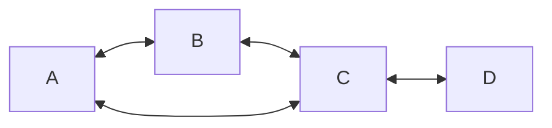
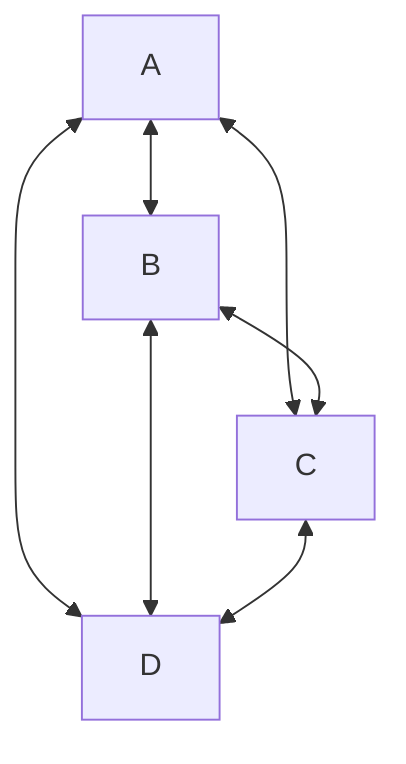

# Teoria dos Grafos

Este guia organiza e apresenta os principais conceitos de **Teoria dos Grafos**, com definições formais, exemplos (Mermaid e LaTeX) e ilustrações.

---

### 1. Formalização Básica

- **Grafo**  
  Um grafo é um par $G=(V,E)$ onde  
  - $V$ é um **conjunto finito de vértices**.  
  - $E\subseteq \{\{u,v\}\mid u,v\in V,\,u\neq v\}$ é o **conjunto de arestas** (para grafos simples não orientados).

- **Ordem**  
  $\lvert V\rvert$: número de vértices.

- **Tamanho**  
  $\lvert E\rvert$: número de arestas.

---

### 2. Vértices, Arestas e Peso

- **Vértice** (nó): elemento de $V$.  
- **Aresta**: par não‑ordenado $\{u,v\}\in E$.  
- **Peso** (em grafos ponderados): função $w\colon E\to\mathbb{R}$.

> **Exemplo (grafo ponderado simples)**  
> ```mermaid
> graph LR
>   A -- 2 --> B
>   B -- 3 --> C
>   A -- 5 --> C
> ```
> Aqui $V=\{A,B,C\}$, $E=\{\{A,B\},\{B,C\},\{A,C\}\}$ e $w(A,B)=2$, etc.

---

### 3. Grau de um Vértice

- **Grau** $d(v)$: número de arestas incidentes em $v$.  
- **Grau mínimo** $\delta(G)=\min_{v\in V} d(v)$.  
- **Grau máximo** $\Delta(G)=\max_{v\in V} d(v)$.  
- **Grafo $k$-regular**: todo vértice tem grau $k$.

**Exemplo**  
No grafo:

> $d(A)=2$, $d(B)=2$, $d(C)=3$, $d(D)=1$.  
> $\delta=1,\ \Delta=3$.

---

### 4. Representações

#### 4.1 Matriz de Adjacência

Para $G=(\{v_1,\dots,v_n\},E)$,  
$$
  A_{ij} =
  \begin{cases}
    1, & \text{se }\{v_i,v_j\}\in E,\\
    0, & \text{caso contrário.}
  \end{cases}
\]

> **Exemplo**  
> Grafo de 4 vértices $V=\{1,2,3,4\}$, $E=\{\{1,2\},\{1,3\},\{2,4\},\{3,4\}\}$:
$$
A = \begin{pmatrix}
0 & 1 & 1 & 0\\
1 & 0 & 0 & 1\\
1 & 0 & 0 & 1\\
0 & 1 & 1 & 0
\end{pmatrix}
$$

#### 4.2 Lista de Adjacência

Para cada $v\in V$, lista de vizinhos $\mathrm{Adj}(v)$.

---

### 5. Tipos de Grafos

1. **Grafo simples**: sem laços nem arestas múltiplas.  
2. **Multigrafo**: permite arestas paralelas.  
3. **Grafo direcionado** (digrama): arestas são pares ordenados $(u,v)$.  
4. **Grafo ponderado**: arestas com pesos.  
5. **Grafo completo** $K_n$: todo par de vértices está conectado.  
6. **Grafo bipartido** $K_{m,n}$: $V$ particionado em $X,Y$, arestas só entre $X$ e $Y$.  
7. **Cíclico** $C_n$: ciclo simples de $n$ vértices.  
8. **Path** $P_n$: caminho com $n$ vértices.

**Exemplo: $K_4$**  

> Este é o grafo completo com 4 vértices.

---

### 6. Subgrafos

- **Subgrafo** $H=(V_H,E_H)$ de $G=(V,E)$ se $V_H\subseteq V$ e $E_H\subseteq E\cap\{\{u,v\}:u,v\in V_H\}$.

---

### 7. Clíques e Número da Clíque

- **Clique**: subgrafo completo de $G$.  
- **Número da clique** $\omega(G)$: tamanho máximo de uma clique em $G$.

---

### 8. Independência e Número de Independência

- **Conjunto independente**: conjunto de vértices sem arestas entre si.  
- **Número de independência** $\alpha(G)$: máximo tamanho de um conjunto independente.

---

### 9. Número Cromático

- **Coloração própria**: atribuir cores a vértices sem cores iguais em arestas adjacentes.  
- **Número cromático** $\chi(G)$: menor número de cores necessárias.

---

### 10. Complemento

- **Grafo complemento** $\overline G$: tem mesmos vértices; $\{u,v\}\in E(\overline G)$ sse $\{u,v\}\notin E(G)$.

---

### 11. Caminhos, Trilhas e Circuitos

- **Trilha**: sequência de arestas sem repetir arestas.  
- **Caminho**: trilha sem repetir vértices.  
- **Circuito**: caminho que começa e termina no mesmo vértice.  
- **Laço**: aresta de um vértice para ele mesmo ($\{v,v\}$).

---

### 12. Conectividade

- **Conexo**: para todo par $u,v$ existe um caminho entre eles.  
- **Desconexo**: caso contrário.  
- **Componente conexa**: subgrafo máximo conexo.  
- **Vértice de corte**: remoção aumenta número de componentes.  
- **Aresta de corte**: remoção desconecta o grafo.  
- **Folha**: vértice de grau 1.

---

### 13. Grafos Especiais

- **Euleriano**: existe circuito que usa cada aresta exatamente uma vez.  
- **Semi‑Euleriano**: existe trilha aberta que usa cada aresta uma vez.  
- **Hamiltoniano**: existe ciclo que visita cada vértice exatamente uma vez.  
- **Semi‑Hamiltoniano**: existe caminho que visita cada vértice uma vez.

---

### 14. Densidade e Conectividade

- **Densidade** $d(G)$:
    $$d(G) = \frac{2|E|}{|V|(|V|-1)},\quad 0\le d(G)\le1$$
- **Conectividade** (vertex‑connectivity $\kappa(G)$, edge‑connectivity $\lambda(G)$):  
  menor número de vértices (ou arestas) cuja remoção desconecta $G$.

---

### 15. Ordem e Tamanho Revisitados

- **Ordem**: $|V|$.  
- **Tamanho**: $|E|$.  

---

> **Referências**  
> - [Wikipedia: Teoria dos Grafos](https://pt.wikipedia.org/wiki/Teoria_dos_grafos)  
> - Handout Unicamp: mod15-handout.pdf  
> - Capítulo 1 UFRGS: Capitulo 1.pdf  
> - BaseCS Medium: A Gentle Introduction to Graph Theory  
> - Bondy & Murty: GTWA.pdf  
> - DataCamp: Introduction to Graph Theory  
