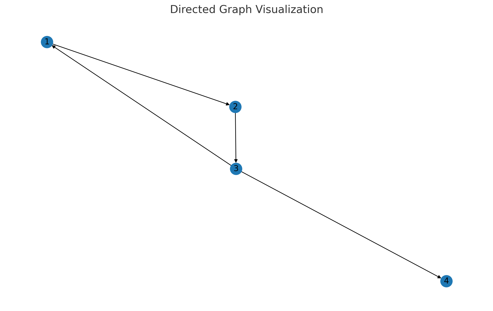

# Teoria dos grafos - Parte 2

### Grafos direcionados

Conceito: São pares $G = (V,E)$ onde $V$ é o conjunto de vértices e $E \subset V \times V$ são arcos ordenados.  
Cada arco $(u,v)$ aponta de $u$ para $v$.

Notação:
- Grau de saída: $deg^+(v)=|\{(v,u)\in E\}|$
- Grau de entrada: $deg^-(v)=|\{(u,v)\in E\}|$
- Fórmula de conservação (em redes): $$\sum_{v\in V} deg^+(v) = \sum_{v\in V} deg^-(v) = |E|$$
> Vizualização: 

### Grafos Ponderados

Conceito: Grafo ponderado é um grafo $G = (V, E, w)$, onde cada aresta $e \in E$ tem peso $w(e) \in \mathbb{R}$.

Representação matricial: matriz de adjacência $A$, onde
$
A_{ij} = 
\begin{cases}
w(i,j), & \text{se }(i,j)\in E,\\
0 \text{ (ou }\infty\text{)}, & \text{caso contrário.}
\end{cases}
$

> Visualização: 

Algoritmos clássicos:
- Dijkstra (pesos não negativos).
- Bellman–Ford (pesos negativos permitidos, sem ciclos negativos).

Exemplo de fórmula de caminho mínimo (programação dinâmica):

$$
dist_v^{(k)} = \min_{u \in V} (dist_u^{(k-1)} + w(u,v))
$$

onde $k$ é o número de arestas permitidas.

### Grafo planar

Conceito: Grafos que podem ser desenhados no plano sem arestas cruzadas.

- Critério de Kuratowski: Um grafo é não planar se e somente se contém subdivisão de $K_5$ ou $K_{3,3}$.
- Fórmula de Euler (para grafos conectados e desenhos planos):
    $$|V| - |E| + |F| = 2$$
    onde $V$ é o número de vértices, $E$ é o número de arestas e $F$ é o número de faces.

### Coloração de grafos

- Conceito: Atribuir cores a vértices de modo que vértices adjacentes tenham cores distintas.
- Número cromático $\chi(G)$: menor número de cores necessárias.
- Desigualdade de Brooks: Para qualquer grafo conectado, não completo nem ciclo ímpar, $\chi(G) \le \Delta(G)$, onde $\Delta(G)$ é o grau máximo.
- Aplicações: alocação de recursos, agendamento e registro de variáveis em compiladores.

### Interpretações de grafos

- Redes de comunicação: vértices como usuários e arcos como canais (direcionado) ou laços (não direcionado).
- Rotas e mapas: pesos representam distâncias ou tempos de viagem.
- Relações sociais: grafo não ponderado; direções podem indicar influência.
- Circuitos e malhas: grafos planares modelam placas de circuito sem cruzamento de fios.
- Fluxos e cadeias: grafos direcionados com capacidades e fluxos, aplicados em redes de transporte e algoritmos de fluxo máximo.

